Markdown
# Library System 📚

🌐 **Demo online:** [librarymb.gt.tc](https://librarymb.gt.tc)

### 🔑 Dane do logowania (Wersja Demo)
* **Administrator:** `1@op.pl` / hasło: `123`
* **Użytkownicy:** od `2@op.pl` do `9@op.pl` / hasło: `123`

Aplikacja webowa typu Full-stack do zarządzania i czytania książek online, zintegrowana z autonomicznym modułem do automatycznego tłumaczenia rozdziałów z języka angielskiego na polski.

---

## 📝 Opis projektu

**Library System** to kompleksowa platforma do czytania książek webowych (tzw. *light novels*), składająca się z dwóch niezależnych aplikacji działających w środowisku Docker:

* 📖 **Biblioteka** – główna aplikacja webowa umożliwiająca przeglądanie, czytanie, wyszukiwanie oraz ocenianie książek.
* 🤖 **Tłumacz** – autonomiczne narzędzie do automatycznego pobierania (web scrapingu) i tłumaczenia rozdziałów z serwisu fanmtl.com.

---

## 🛠️ Technologie

### Frontend (Biblioteka)
* **React 18** + **TypeScript** – budowa interfejsu użytkownika
* **Vite** – szybki bundler i środowisko deweloperskie
* **React Router** – routing po stronie klienta (SPA)
* **CSS Modules** – izolowane stylowanie komponentów

### Backend (Biblioteka)
* **PHP 8.2** + **PHP-FPM** – logika serwerowa i REST API
* **MySQL 8.0** – relacyjna baza danych
* **PDO / MySQLi** – bezpieczna komunikacja z bazą danych
* **Nginx** – serwer HTTP oraz reverse proxy dla PHP-FPM

### Tłumacz
* **Node.js** + **Express** – serwer HTTP i API backendowe
* **Puppeteer** – headless browser do zaawansowanego scrapingu treści
* **Google Translate API** – automatyczne tłumaczenie tekstu (EN → PL)
* **React** + **Vite** – intuicyjny panel sterowania procesem tłumaczenia

### DevOps / Infrastruktura
* **Docker** + **Docker Compose** – pełna konteneryzacja środowiska
* **Multi-stage builds** – optymalizacja rozmiaru obrazów produkcyjnych
* **Nginx** – serwowanie plików statycznych frontendu

---

## 📐 Architektura projektu

````text
library-system/
├── Library_app/              # Główna aplikacja biblioteki
│   ├── frontend/biblioteka/  # React + TypeScript (SPA)
│   ├── backend/bibliotekaPHP/# PHP REST API
│   ├── library.sql           # Schema i dane startowe bazy MySQL
│   ├── Dockerfile            # Multi-stage build (Frontend + Backend)
│   ├── docker-compose.yml    # Orkiestracja kontenerów bazy i serwera
│   └── nginx.conf            # Konfiguracja serwera Nginx
│
└── Translate_app/Translate/  # Aplikacja tłumacza
    ├── frontend/tlumacz/     # Panel sterowania (React)
    ├── backend/              # Node.js + Express + Puppeteer
    └── Dockerfile            # Budowanie frontendu i środowiska Node
````
## Funkcjonalności

### Biblioteka
- Przeglądanie listy książek z okładkami, opisami i tagami
- System oceniania książek (1-5 gwiazdek)
- Czytanie rozdziałów z nawigacją (poprzedni/następny)
- Wyszukiwanie książek
- Ranking najlepiej ocenianych książek
- Rekomendacje na podstawie ocen
- Rejestracja i logowanie użytkowników
- Panel admina do zarządzania książkami (dodawanie, usuwanie, edycja tytułu, opisu, okładki)
- Import rozdziałów z plików JSON

### Tłumacz
- Web scraping rozdziałów z fanmtl.com przy użyciu Puppeteer
- Automatyczne tłumaczenie EN→PL przez Google Translate
- Obsługa zakresów rozdziałów (np. rozdział 1-50)
- Retry mechanism przy błędach pobierania
- Eksport przetłumaczonych rozdziałów do formatu JSON
- Panel logów w czasie rzeczywistym

## Jak to działa?

1. Tłumacz pobiera treść rozdziałów ze strony fanmtl.com używając headless Chromium (Puppeteer)
2. Tekst jest dzielony na fragmenty i tłumaczony przez Google Translate API
3. Przetłumaczone rozdziały są zapisywane jako plik JSON w folderze `exports/`
4. Plik JSON jest kopiowany do folderu `mojprojekt/` w bibliotece
5. Endpoint `import_json.php` importuje rozdziały do bazy MySQL
6. Rozdziały są dostępne do czytania w aplikacji biblioteki

## Instalacja i uruchomienie

### Wymagania
- Docker Desktop (https://www.docker.com/products/docker-desktop/)
- Git

### 1. Sklonuj repozytorium
git clone https://github.com/MateuszBiern/library-system.git

### 2. Uruchom bibliotekę
cd library-system/Library_app

docker compose up --build
Biblioteka dostępna pod: **http://localhost**

### 3. Uruchom tłumacz (nowe okno terminala)
cd library-system/Translate_app/Translate

docker compose up --build
Tłumacz dostępny pod: **http://localhost:5000**

## Jak dodać nową książkę?

1. Zaloguj się do biblioteki i dodaj książkę przez panel admina
2. Zapamiętaj ID książki
3. Wejdź na http://localhost:5000
4. Podaj:
   - **Book ID** - ID książki z biblioteki
   - **Base URL** - link do książki np. `https://www.fanmtl.com/novel/ke423463_1.html`
   - **From/To chapter** - zakres rozdziałów do pobrania
5. Kliknij **Start** i poczekaj na zakończenie
6. Skopiuj wygenerowany plik JSON z `exports/` do `Library_app/backend/bibliotekaPHP/mojprojekt/`
7. Wejdź na `http://localhost/api/import_json` aby zaimportować rozdziały

## Screenshots

### Main page
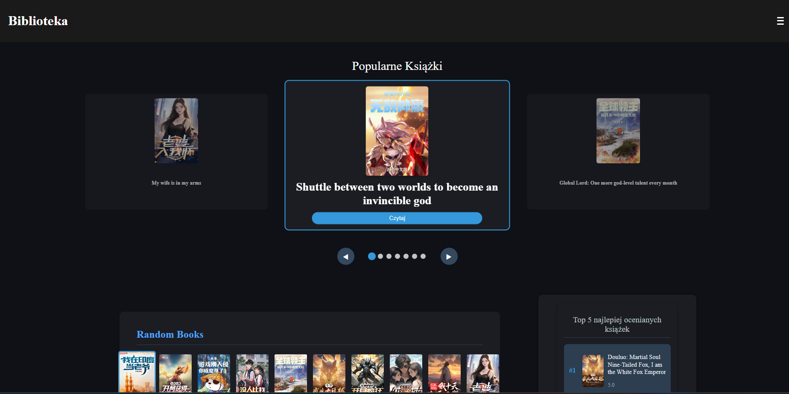

### Recommendations
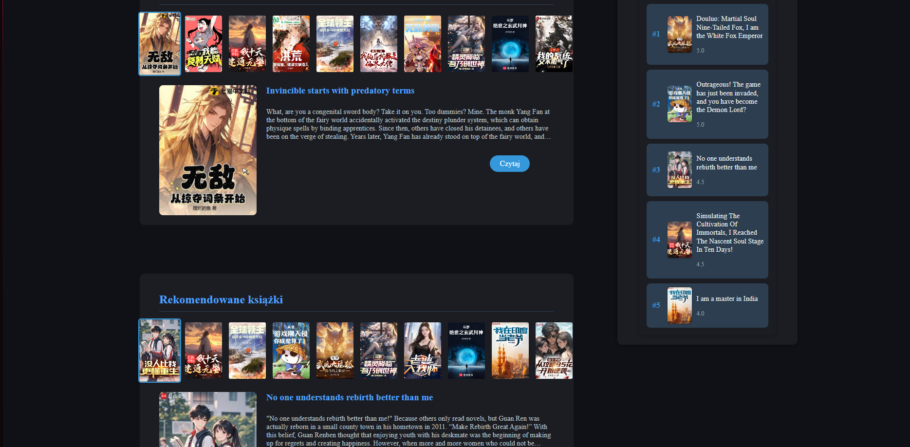

### Last added books
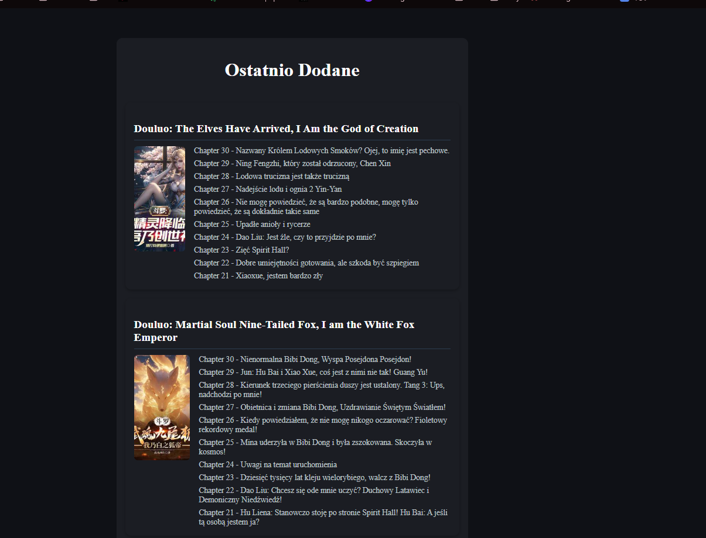

### Search
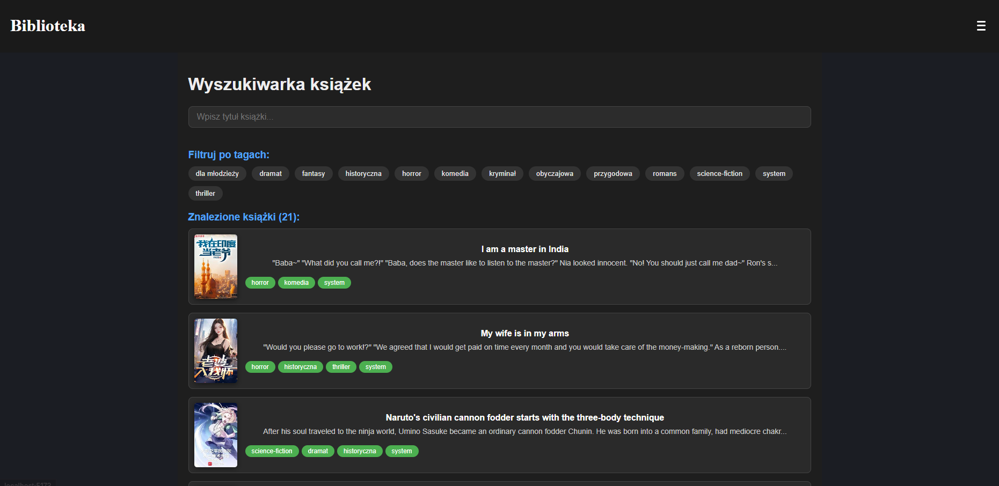

### Book page
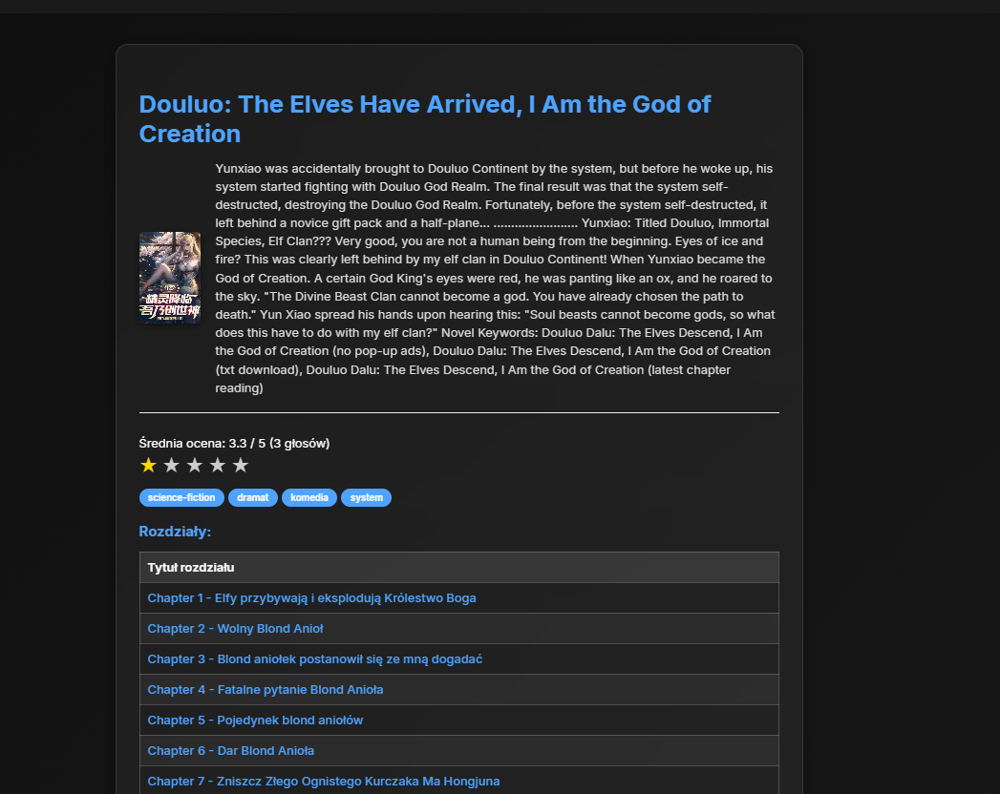

### Book chapter reader
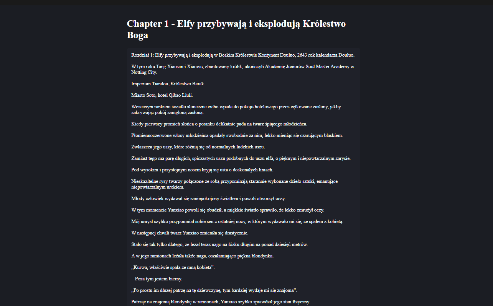

### Chapter Pagination
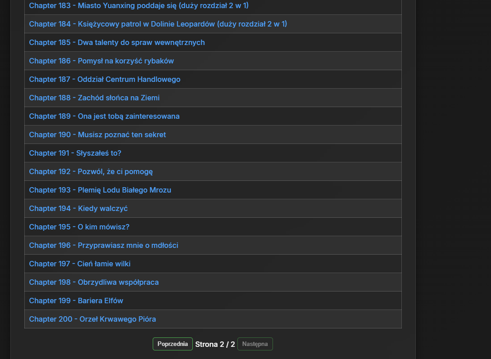

### Book pagination
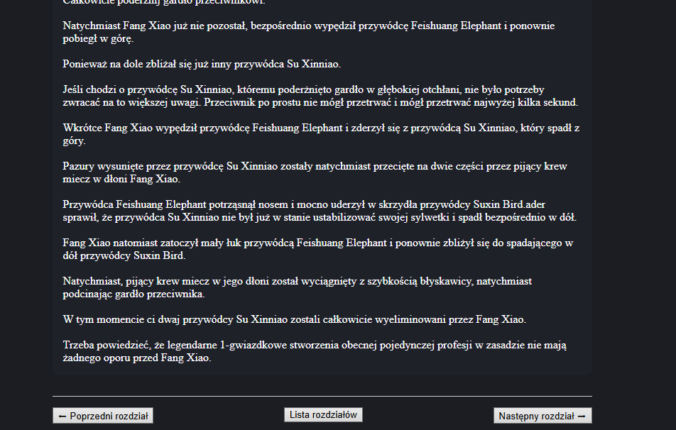

### Login
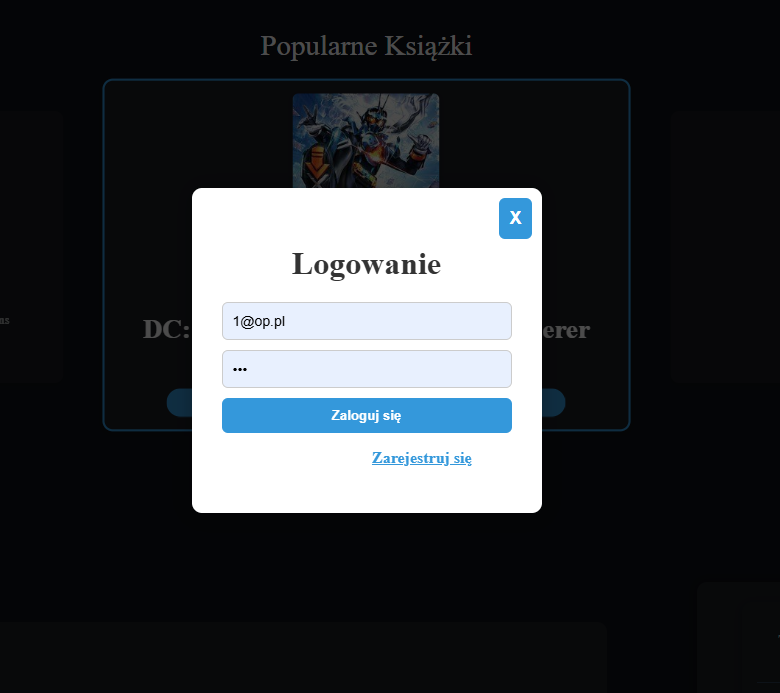

### Add book (admin)
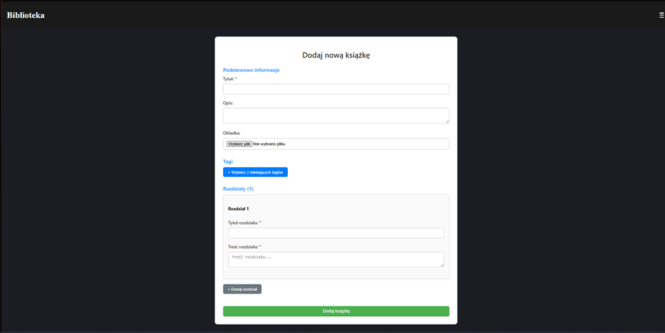

### Edit books (admin panel)
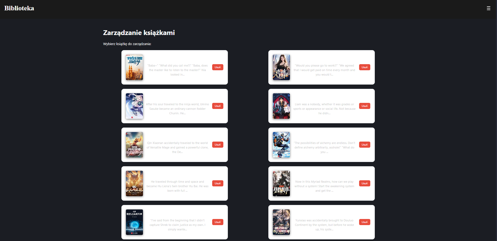

### Edit book details
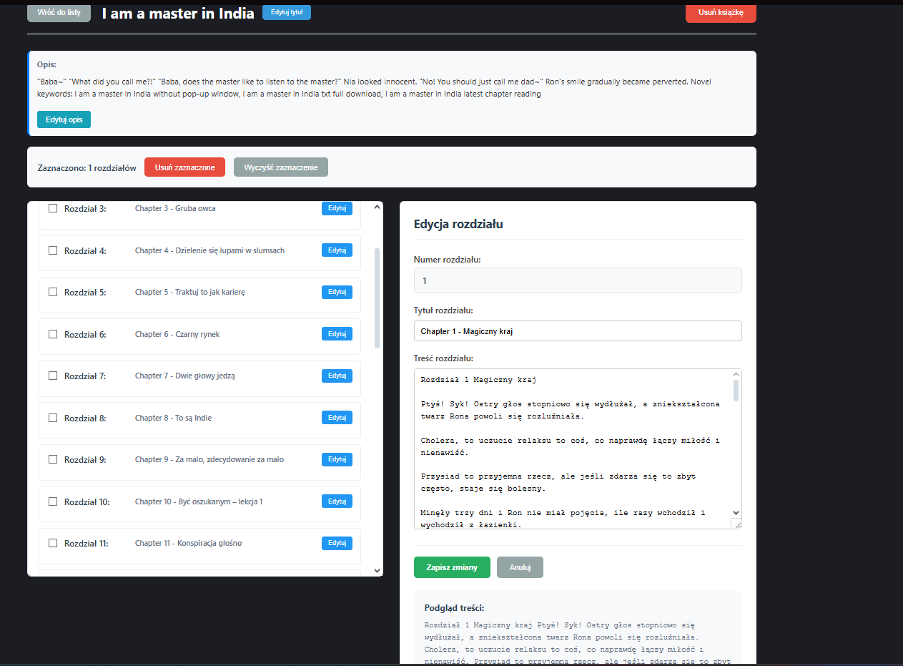

- Pierwsze uruchomienie może potrwać kilka minut (pobieranie obrazów Docker + budowanie frontendu)
- Baza danych jest automatycznie inicjalizowana przy pierwszym uruchomieniu
- Tłumaczenie dużej liczby rozdziałów może potrwać długo ze względu na limity Google Translate

